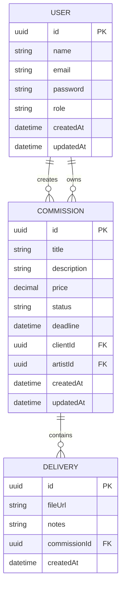

# SSD — Software Design Document

## Modelagem de Dados — CommissionTrack

# 1. Diagrama ER (Mermaid)



---

# 2. Dicionário de Entidades

## USER

Representa usuários autenticados do sistema.

Pode possuir dois papéis:

```
ARTIST
CLIENT
```

Campos:

| Campo     | Tipo     | Obrigatório | Descrição           |
| --------- | -------- | ----------- | ------------------- |
| id        | UUID     | sim         | Identificador único |
| name      | string   | sim         | Nome do usuário     |
| email     | string   | sim         | Email único         |
| password  | string   | sim         | Hash da senha       |
| role      | enum     | sim         | Papel do usuário    |
| createdAt | datetime | sim         | Data criação        |
| updatedAt | datetime | sim         | Data atualização    |

Relacionamentos:

```
USER (ARTIST) 1:N COMMISSION
USER (CLIENT) 1:N COMMISSION
```

---

## COMMISSION

Representa uma comissão artística solicitada por um cliente.

Campos:

| Campo       | Tipo     | Obrigatório | Descrição           |
| ----------- | -------- | ----------- | ------------------- |
| id          | UUID     | sim         | Identificador       |
| title       | string   | sim         | Nome da comissão    |
| description | string   | sim         | Detalhes            |
| price       | decimal  | sim         | Valor               |
| status      | enum     | sim         | Status atual        |
| deadline    | datetime | sim         | Prazo entrega       |
| clientId    | UUID     | sim         | Cliente dono        |
| artistId    | UUID     | sim         | Artista responsável |
| createdAt   | datetime | sim         | Criação             |
| updatedAt   | datetime | sim         | Atualização         |

Enum status permitido:

```
PENDING
IN_PROGRESS
WAITING_PAYMENT
COMPLETED
CANCELLED
```

Relacionamentos:

```
COMMISSION N:1 USER (CLIENT)
COMMISSION N:1 USER (ARTIST)
COMMISSION 1:N DELIVERY
```

---

## DELIVERY

Representa arquivos entregues ao cliente.

Campos:

| Campo        | Tipo     | Obrigatório | Descrição     |
| ------------ | -------- | ----------- | ------------- |
| id           | UUID     | sim         | Identificador |
| fileUrl      | string   | sim         | URL entrega   |
| notes        | string   | não         | Observações   |
| commissionId | UUID     | sim         | Comissão      |
| createdAt    | datetime | sim         | Data envio    |

Relacionamentos:

```
DELIVERY N:1 COMMISSION
```

---

# 3. Regras de Integridade

Constraints:

```
email UNIQUE
price > 0
deadline > createdAt
```

Regras adicionais:

```
CLIENT só visualiza próprias commissions
ARTIST cria commissions
DELIVERY pertence a apenas uma commission
```

---

# 4. Justificativa Arquitetural

Decisões tomadas:

User unificado:

Permite autenticação simples com JWT

Role-based access:

Compatível com Guards do NestJS

Delivery separado:

Permite múltiplas revisões futuras

Commission como entidade central:

Mantém relação 1:N obrigatória da disciplina


# Contrato da API — CommissionTrack

Base URL:

```
/api/v1
```

Autenticação:

```
Bearer Token (JWT)
```

Roles disponíveis:

```
ARTIST
CLIENT
```

---

# 1. Auth Module

## POST /auth/register

Cria novo usuário no sistema.

Permissão:

```
PUBLIC
```

Request:

```json
{
"name": "string",
"email": "string",
"password": "string",
"role": "ARTIST | CLIENT"
}
```

Response:

```json
{
"id": "uuid",
"name": "string",
"email": "string",
"role": "CLIENT",
"createdAt": "datetime"
}
```

---

## POST /auth/login

Autentica usuário.

Permissão:

```
PUBLIC
```

Request:

```json
{
"email": "string",
"password": "string"
}
```

Response:

```json
{
"accessToken": "jwt_token"
}
```

---

# 2. User Module

## GET /users/me

Retorna dados do usuário autenticado.

Permissão:

```
AUTHENTICATED
```

Response:

```json
{
"id": "uuid",
"name": "string",
"email": "string",
"role": "CLIENT"
}
```

---

# 3. Commission Module

## POST /commissions

Cria nova comissão.

Permissão:

```
ARTIST
```

Request:

```json
{
"title": "Portrait",
"description": "Half body portrait",
"price": 150.00,
"deadline": "2026-06-01",
"clientId": "uuid"
}
```

Response:

```json
{
"id": "uuid",
"title": "Portrait",
"status": "PENDING",
"price": 150.00,
"deadline": "datetime",
"clientId": "uuid",
"artistId": "uuid"
}
```

---

## GET /commissions

Lista comissões visíveis ao usuário.

Permissão:

```
AUTHENTICATED
```

Regras:

```
CLIENT vê apenas próprias commissions
ARTIST vê todas
```

Response:

```json
[
{
"id": "uuid",
"title": "Portrait",
"status": "IN_PROGRESS",
"deadline": "datetime"
}
]
```

---

## GET /commissions/:id

Retorna detalhes de uma comissão.

Permissão:

```
OWNER OR ARTIST
```

Response:

```json
{
"id": "uuid",
"title": "Portrait",
"description": "Half body portrait",
"price": 150.00,
"status": "IN_PROGRESS",
"deadline": "datetime",
"clientId": "uuid",
"artistId": "uuid"
}
```

---

## PATCH /commissions/:id/status

Atualiza status da comissão.

Permissão:

```
ARTIST
```

Request:

```json
{
"status": "IN_PROGRESS"
}
```

Response:

```json
{
"id": "uuid",
"status": "IN_PROGRESS"
}
```

Status possíveis:

```
PENDING
IN_PROGRESS
WAITING_PAYMENT
COMPLETED
CANCELLED
```

---

## PATCH /commissions/:id

Atualiza dados da comissão.

Permissão:

```
ARTIST
```

Request:

```json
{
"title": "Updated title",
"description": "Updated description",
"price": 200.00,
"deadline": "2026-07-01"
}
```

Response:

```json
{
"id": "uuid",
"title": "Updated title",
"description": "Updated description"
}
```

---

## DELETE /commissions/:id

Remove comissão.

Permissão:

```
ARTIST
```

Response:

```json
{
"message": "Commission deleted successfully"
}
```

---

# 4. Delivery Module

## POST /deliveries

Adiciona entrega à comissão.

Permissão:

```
ARTIST
```

Request:

```json
{
"fileUrl": "https://cdn.art.com/file.png",
"notes": "Final version",
"commissionId": "uuid"
}
```

Response:

```json
{
"id": "uuid",
"fileUrl": "string",
"commissionId": "uuid"
}
```

---

## GET /deliveries/:commissionId

Lista entregas de uma comissão.

Permissão:

```
OWNER OR ARTIST
```

Response:

```json
[
{
"id": "uuid",
"fileUrl": "string",
"notes": "string",
"createdAt": "datetime"
}
]
```

---

# 5. Regras de Segurança da API

Proteções obrigatórias:

```
JWT obrigatório em rotas privadas
RoleGuard ativo
Ownership validation ativa
ValidationPipe whitelist true
```

---

# 6. Padrão de Resposta da API

Formato sucesso:

```json
{
"success": true,
"data": {}
}
```

Formato erro:

```json
{
"success": false,
"statusCode": 400,
"message": "Validation error"
}
```
