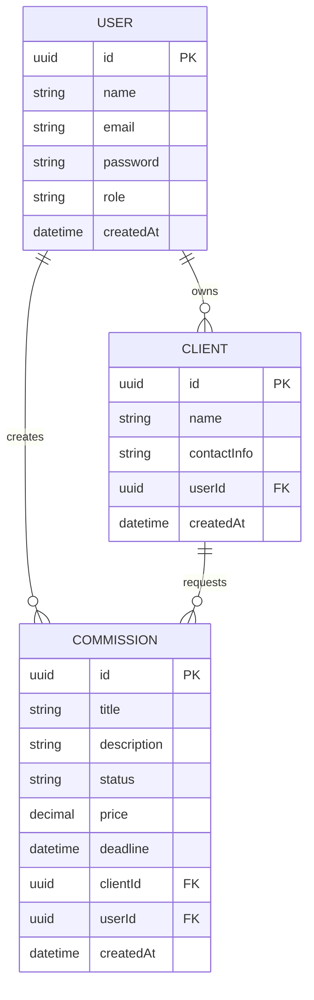

# SDD — Software Design Document
## CommissionTrack — Sistema de Gestão de Comissões Artísticas

---

# 1. Visão da Arquitetura

O CommissionTrack é uma aplicação full-cycle baseada em arquitetura cliente-servidor composta por:

- Backend: NestJS
- ORM: Prisma
- Banco relacional: PostgreSQL
- Autenticação: JWT
- Documentação: Swagger
- Testes automatizados: Jest
- Organização: Monorepo (frontend + backend)

O backend seguirá arquitetura modular em camadas:

- Controllers
- Services
- Modules
- DTOs
- Guards
- Interceptors
- Exception Filters

---

# 2. Modelagem de Dados

A modelagem segue estrutura relacional com três entidades principais:

- User
- Client
- Commission

Relacionamentos:
- User 1:N Client
- User 1:N Commission
- Client 1:N Commission

# SDD — Modelagem de Dados (CommissionTrack)

## 1. Diagrama Entidade-Relacionamento (ER Diagram)

